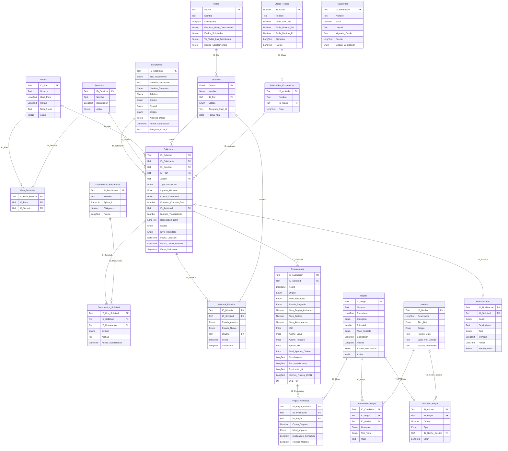

# Modelo de datos — Google Sheets / AppSheet

> Generado por `npm run sistema-experto:generar`. No editar a mano.

20 tablas agrupadas en 5 bloques. Cada tabla es una pestaña del archivo `sistema-experto/salida/SolutaPLUS_BaseDatos.xlsx`.

## Diagrama entidad-relación

## Seguridad

### Roles

Roles del sistema y sus permisos. AppSheet los usa en los Security filters y en las condiciones Show_If / Editable_If. _Filas iniciales: 3._

| Columna | Tipo en AppSheet | Obligatoria | Descripción |
|---|---|---|---|
| **ID_Rol** 🔑 | Text | Sí | Código del rol (ADMIN, ASESOR, SUPERVISOR). |
| Nombre | Text | Sí | Nombre visible del rol. |
| Descripcion | LongText | No | Qué puede hacer el rol. |
| Gestiona_Base_Conocimiento | Yes/No | Sí | Puede crear y editar reglas, condiciones, acciones y parámetros. |
| Evalua_Solicitudes | Yes/No | Sí | Puede ejecutar el motor de decisión y cambiar el estado de una solicitud. |
| Ve_Todas_Las_Solicitudes | Yes/No | Sí | Si es FALSE, solo ve las solicitudes que tiene asignadas. |
| Recibe_Escalamientos | Yes/No | Sí | Recibe por Telegram las solicitudes críticas escaladas. |

### Usuarios

Personas que usan la app. El correo debe ser la cuenta de Google con la que inician sesión en AppSheet (USEREMAIL()). _Filas iniciales: 4._

| Columna | Tipo en AppSheet | Obligatoria | Descripción |
|---|---|---|---|
| **Correo** 🔑 | Email | Sí | Correo de Google del usuario. |
| Nombre | Name | Sí | Nombre completo. |
| ID_Rol | Ref → Roles | Sí | Rol asignado. |
| Estado | Enum: Activo / Inactivo | Sí | Un usuario Inactivo no puede entrar a la app. |
| Telegram_Chat_ID | Text | No | Chat de Telegram donde n8n le envía alertas y escalamientos. |
| Fecha_Alta | Date | Sí | Fecha de creación del usuario. |

## Catálogos

### Servicios

Servicios de afiliación (mismos de la landing: constants/services.ts). _Filas iniciales: 4._

| Columna | Tipo en AppSheet | Obligatoria | Descripción |
|---|---|---|---|
| **ID_Servicio** 🔑 | Text | Sí | Slug del servicio. |
| Nombre | Text | Sí | Nombre visible. |
| Descripcion | LongText | No | Descripción corta. |
| Activo | Yes/No | Sí | Si se ofrece actualmente. |

### Planes

Paquetes comerciales (mismos de la landing: constants/pricing-plans.ts). _Filas iniciales: 3._

| Columna | Tipo en AppSheet | Obligatoria | Descripción |
|---|---|---|---|
| **ID_Plan** 🔑 | Text | Sí | Slug del plan. |
| Nombre | Text | Sí | Nombre visible. |
| Ideal_Para | LongText | No | Perfil de cliente al que apunta. |
| Incluye | LongText | No | Coberturas incluidas. |
| Nota_Precio | Text | No | Cómo se calcula el precio. |
| Activo | Yes/No | Sí | Si se ofrece actualmente. |

### Plan_Servicios

Relación muchos a muchos: qué servicios incluye cada plan. _Filas iniciales: 8._

| Columna | Tipo en AppSheet | Obligatoria | Descripción |
|---|---|---|---|
| **ID_Plan_Servicio** 🔑 | Text | Sí | Identificador de la relación. |
| ID_Plan | Ref → Planes (parte de) | Sí | Plan. |
| ID_Servicio | Ref → Servicios | Sí | Servicio incluido en el plan. |

### Clases_Riesgo

Clases de riesgo del Sistema General de Riesgos Laborales y su tarifa de ARL. _Filas iniciales: 5._

| Columna | Tipo en AppSheet | Obligatoria | Descripción |
|---|---|---|---|
| **ID_Clase** 🔑 | Number | Sí | Clase de riesgo (1 a 5). |
| Nombre | Text | Sí | Nombre de la clase. |
| Tarifa_ARL_Pct | Decimal | Sí | Tarifa inicial en % del IBC. Es la que usa el motor. |
| Tarifa_Minima_Pct | Decimal | No | Límite inferior de la tarifa (%). |
| Tarifa_Maxima_Pct | Decimal | No | Límite superior de la tarifa (%). |
| Ejemplos | LongText | No | Actividades de ejemplo de la clase. |
| Fuente | LongText | Sí | Norma de donde salen los valores. |

### Actividades_Economicas

Actividades con su clase de riesgo. Catálogo orientativo para el ejercicio: la clase exacta la define el código CIIU en la tabla del Decreto 768 de 2022. _Filas iniciales: 5._

| Columna | Tipo en AppSheet | Obligatoria | Descripción |
|---|---|---|---|
| **ID_Actividad** 🔑 | Text | Sí | Identificador de la actividad. |
| Nombre | Text | Sí | Nombre de la actividad. |
| ID_Clase | Ref → Clases_Riesgo | Sí | Clase de riesgo de la actividad. |
| Nota | LongText | No | Aclaraciones sobre la clasificación. |

### Documentos_Requeridos

Documentos que se exigen según el tipo de vinculación (política interna de SolutaPLUS). _Filas iniciales: 6._

| Columna | Tipo en AppSheet | Obligatoria | Descripción |
|---|---|---|---|
| **ID_Documento** 🔑 | Text | Sí | Identificador del documento. |
| Nombre | Text | Sí | Nombre del documento. |
| Aplica_A | EnumList: Contratista / Cuenta propia / Empleador | Sí | Tipos de vinculación que deben presentarlo. |
| Obligatorio | Yes/No | Sí | Si cuenta para el % de documentación completa. |
| Fuente | LongText | No | Por qué se exige. |

## Operación

### Solicitantes

Personas o empresas que piden afiliación (llegan por la landing, AppSheet o Telegram). _Filas iniciales: 7._

| Columna | Tipo en AppSheet | Obligatoria | Descripción |
|---|---|---|---|
| **ID_Solicitante** 🔑 | Text | Sí | Identificador del solicitante. |
| Tipo_Documento | Enum: CC / CE / PPT / NIT | Sí | Tipo de documento de identidad. |
| Numero_Documento | Text | Sí | Número de documento. |
| Nombre_Completo | Name | Sí | Nombre o razón social. |
| Telefono | Phone | Sí | Teléfono de contacto. |
| Correo | Email | No | Correo de contacto. |
| Ciudad | Enum: 21 valores | Sí | Ciudad de residencia. |
| Origen | Enum: Landing / AppSheet / Telegram | Sí | Canal por el que llegó el solicitante. |
| Autoriza_Datos | Yes/No | Sí | Autorización previa de tratamiento de datos (Ley 1581 de 2012). |
| Fecha_Autorizacion | DateTime | No | Evidencia de cuándo se otorgó la autorización. |
| Telegram_Chat_ID | Text | No | Chat de Telegram para que consulte el estado de su solicitud. |

### Solicitudes

Solicitud de afiliación. Sus columnas son los hechos de entrada del motor de decisión. _Filas iniciales: 7._

| Columna | Tipo en AppSheet | Obligatoria | Descripción |
|---|---|---|---|
| **ID_Solicitud** 🔑 | Text | Sí | Radicado de la solicitud. |
| ID_Solicitante | Ref → Solicitantes | Sí | Quién pide la afiliación. |
| ID_Servicio | Ref → Servicios | Sí | Servicio solicitado. |
| ID_Plan | Ref → Planes | No | Plan elegido (opcional). |
| Asesor | Ref → Usuarios | No | Asesor asignado. |
| Tipo_Vinculacion | Enum: Contratista / Cuenta propia / Empleador | Sí | Cómo trabaja el solicitante. Determina qué reglas aplican. |
| Ingreso_Mensual | Price | No | Ingreso mensual bruto sin IVA (para empleadores se deja vacío). |
| Costos_Deducibles | Price | No | Costos de la actividad (solo independientes por cuenta propia). |
| Duracion_Contrato_Dias | Number | No | Duración del contrato de prestación de servicios, en días. |
| ID_Actividad | Ref → Actividades_Economicas | No | Actividad económica (define la clase de riesgo ARL). |
| Numero_Trabajadores | Number | No | Trabajadores a afiliar (solo empleadores). |
| Descripcion_Libre | LongText | No | Lo que el solicitante contó con sus palabras. El agente IA lo interpreta. |
| Estado | Enum: Nueva / En evaluación / Pendiente documentos / En revisión / Aprobada / Bloqueada / Afiliada / Cancelada | Sí | Estado del flujo de la solicitud. |
| Nivel_Resultado | Enum: Viable / Requiere revisión / Crítica | No | Clasificación de la última evaluación del motor. |
| Fecha_Creacion | DateTime | Sí | Fecha de radicación. |
| Fecha_Ultima_Gestion | DateTime | Sí | Última vez que un usuario la gestionó (base del escalamiento). |
| Firma_Solicitante | Signature | No | Firma capturada en AppSheet; se incluye en el PDF. |

### Documentos_Solicitud

Documentos entregados por cada solicitud. De aquí sale el hecho porcentaje_documentos. _Filas iniciales: 27._

| Columna | Tipo en AppSheet | Obligatoria | Descripción |
|---|---|---|---|
| **ID_Doc_Solicitud** 🔑 | Text | Sí | Identificador del documento entregado. |
| ID_Solicitud | Ref → Solicitudes (parte de) | Sí | Solicitud. |
| ID_Documento | Ref → Documentos_Requeridos | Sí | Documento. |
| Estado | Enum: Pendiente / Recibido / Rechazado | Sí | Estado de revisión. |
| Archivo | File | No | Archivo cargado. |
| Fecha_Actualizacion | DateTime | No | Última actualización. |

### Historial_Estados

Trazabilidad de cada cambio de estado de una solicitud. _Filas iniciales: 7._

| Columna | Tipo en AppSheet | Obligatoria | Descripción |
|---|---|---|---|
| **ID_Historial** 🔑 | Text | Sí | Identificador del cambio. |
| ID_Solicitud | Ref → Solicitudes (parte de) | Sí | Solicitud. |
| Estado_Anterior | Enum: Nueva / En evaluación / Pendiente documentos / En revisión / Aprobada / Bloqueada / Afiliada / Cancelada | No | Estado antes del cambio. |
| Estado_Nuevo | Enum: Nueva / En evaluación / Pendiente documentos / En revisión / Aprobada / Bloqueada / Afiliada / Cancelada | Sí | Estado después del cambio. |
| Usuario | Ref → Usuarios | No | Quién hizo el cambio (vacío = sistema). |
| Fecha | DateTime | Sí | Momento del cambio. |
| Comentario | LongText | No | Motivo del cambio. |

## Base de conocimiento

### Hechos

Diccionario de hechos: variables que las reglas leen o escriben. Nombres en minúscula. _Filas iniciales: 27._

| Columna | Tipo en AppSheet | Obligatoria | Descripción |
|---|---|---|---|
| **ID_Hecho** 🔑 | Text | Sí | Nombre del hecho (snake_case, minúsculas). |
| Descripcion | LongText | Sí | Qué representa. |
| Tipo_Dato | Enum: Número / Texto / SI/NO | Sí | Tipo de valor. |
| Origen | Enum: Entrada / Derivado / Motor | Sí | Entrada: viene de las tablas. Derivado: lo escriben las reglas. Motor: lo calcula el motor. |
| Fuente_Dato | Text | No | Columna o cálculo del que sale un hecho de entrada. |
| Valor_Por_Defecto | Text | No | Valor que se usa si la entrada viene vacía. |
| Valores_Permitidos | Text | No | Dominio del hecho, separado por \|. Vacío = libre. |

### Parametros

Valores configurables que usan las reglas (topes, tarifas, umbrales). Nombres en MAYÚSCULAS. _Filas iniciales: 12._

| Columna | Tipo en AppSheet | Obligatoria | Descripción |
|---|---|---|---|
| **ID_Parametro** 🔑 | Text | Sí | Nombre del parámetro (MAYÚSCULAS). |
| Nombre | Text | Sí | Nombre legible. |
| Valor | Decimal | Sí | Valor numérico. |
| Unidad | Text | Sí | Unidad del valor. |
| Vigencia_Desde | Date | Sí | Fecha desde la que el sistema aplica este valor. |
| Fuente | LongText | Sí | Norma o política de donde sale. |
| Estado_Verificacion | Enum: Verificado / Por validar / Política interna | Sí | Si el valor está verificado en una fuente oficial. |

### Reglas

Reglas SI-ENTONCES. Sus condiciones y acciones están en tablas hijas. _Filas iniciales: 29._

| Columna | Tipo en AppSheet | Obligatoria | Descripción |
|---|---|---|---|
| **ID_Regla** 🔑 | Text | Sí | Código de la regla (R01, R02...). |
| Nombre | Text | Sí | Nombre corto. |
| Enunciado | LongText | Sí | La regla en lenguaje natural «SI … ENTONCES …». Admite {PARAMETROS}. |
| Categoria | Enum: Validación de datos / Ingreso base de cotización / Obligatoriedad / Riesgos laborales / Liquidación / Coherencia comercial / Documentación / Consolidación | Sí | Grupo temático. |
| Prioridad | Number | Sí | Orden de disparo: menor número = se evalúa antes. Única por regla. |
| Nivel_Impacto | Enum: Normal / Advertencia / Crítico | Sí | Impacto que suma la regla al activarse. |
| Explicacion | LongText | Sí | Plantilla del «por qué» que se muestra al usuario. Admite {hechos} y {PARAMETROS}. |
| Fuente | LongText | Sí | Norma o política que respalda la regla. |
| Estado_Verificacion | Enum: Verificado / Por validar / Política interna | Sí | Si el respaldo normativo está verificado. |
| Activa | Yes/No | Sí | Si FALSE, el motor la ignora. |

### Condiciones_Regla

Parte SI de cada regla. Todas las condiciones de una regla deben cumplirse (Y lógico). _Filas iniciales: 56._

| Columna | Tipo en AppSheet | Obligatoria | Descripción |
|---|---|---|---|
| **ID_Condicion** 🔑 | Text | Sí | Identificador de la condición. |
| ID_Regla | Ref → Reglas (parte de) | Sí | Regla a la que pertenece. |
| ID_Hecho | Ref → Hechos | Sí | Hecho que se evalúa. |
| Operador | Enum: 9 valores | Sí | Comparación. |
| Tipo_Valor | Enum: Literal / Expresion | No | Literal: valor fijo. Expresion: cálculo con hechos y parámetros. Vacío para EXISTE / NO_EXISTE. |
| Valor | Text | No | Valor contra el que se compara. En EN_LISTA, valores separados por \|. |

### Acciones_Regla

Parte ENTONCES de cada regla, ejecutada en orden. _Filas iniciales: 51._

| Columna | Tipo en AppSheet | Obligatoria | Descripción |
|---|---|---|---|
| **ID_Accion** 🔑 | Text | Sí | Identificador de la acción. |
| ID_Regla | Ref → Reglas (parte de) | Sí | Regla a la que pertenece. |
| Orden | Number | Sí | Orden de ejecución dentro de la regla. |
| Tipo | Enum: ASIGNAR / CALCULAR / CONCLUIR / RECOMENDAR / ALERTAR | Sí | ASIGNAR/CALCULAR escriben un hecho; CONCLUIR/RECOMENDAR/ALERTAR generan texto. |
| ID_Hecho_Destino | Ref → Hechos | No | Hecho que se escribe (solo ASIGNAR y CALCULAR). |
| Valor | LongText | Sí | Literal (ASIGNAR), expresión (CALCULAR) o plantilla de texto. |

## Resultados del motor

### Evaluaciones

Resultado de cada ejecución del motor sobre una solicitud (lo escribe n8n). _Filas iniciales: 0._

| Columna | Tipo en AppSheet | Obligatoria | Descripción |
|---|---|---|---|
| **ID_Evaluacion** 🔑 | Text | Sí | Identificador de la evaluación. |
| ID_Solicitud | Ref → Solicitudes | Sí | Solicitud evaluada. |
| Fecha | DateTime | Sí | Momento de la evaluación. |
| Origen | Enum: Automática (n8n) / Manual (AppSheet) / Telegram | Sí | Desde dónde se disparó la evaluación. |
| Nivel_Resultado | Enum: Viable / Requiere revisión / Crítica | Sí | Clasificación final. |
| Estado_Sugerido | Enum: Nueva / En evaluación / Pendiente documentos / En revisión / Aprobada / Bloqueada / Afiliada / Cancelada | No | Estado que sugiere el motor (el asesor decide). |
| Num_Reglas_Activadas | Number | No | Cuántas reglas se activaron. |
| Num_Criticas | Number | No | Reglas críticas activadas. |
| Num_Advertencias | Number | No | Reglas de advertencia activadas. |
| IBC | Price | No | Ingreso base de cotización final. |
| Aporte_Salud | Price | No | Aporte mensual a Salud. |
| Aporte_Pension | Price | No | Aporte mensual a Pensión. |
| Aporte_ARL | Price | No | Aporte mensual a ARL. |
| Total_Aportes_Cliente | Price | No | Total mensual a cargo del solicitante. |
| Conclusiones | LongText | No | Conclusiones generadas por las reglas. |
| Recomendaciones | LongText | No | Recomendaciones para el asesor. |
| Explicacion_IA | LongText | No | Explicación en lenguaje natural redactada por el agente IA. |
| Hechos_Finales_JSON | LongText | No | Todos los hechos al terminar la inferencia (trazabilidad). |
| URL_PDF | Url | No | Informe PDF de la evaluación. |

### Reglas_Activadas

Explicación trazable: qué reglas se activaron, en qué orden y por qué. _Filas iniciales: 0._

| Columna | Tipo en AppSheet | Obligatoria | Descripción |
|---|---|---|---|
| **ID_Regla_Activada** 🔑 | Text | Sí | Identificador. |
| ID_Evaluacion | Ref → Evaluaciones (parte de) | Sí | Evaluación. |
| ID_Regla | Ref → Reglas | Sí | Regla que se activó. |
| Orden_Disparo | Number | Sí | Posición en la cadena de inferencia. |
| Nivel_Impacto | Enum: Normal / Advertencia / Crítico | Sí | Impacto de la regla. |
| Explicacion_Generada | LongText | Sí | Plantilla de la regla con los valores reales. |
| Hechos_Usados | LongText | No | Valores de los hechos que evaluaron sus condiciones. |

### Notificaciones

Registro de los mensajes que n8n envía por Telegram. _Filas iniciales: 0._

| Columna | Tipo en AppSheet | Obligatoria | Descripción |
|---|---|---|---|
| **ID_Notificacion** 🔑 | Text | Sí | Identificador. |
| ID_Solicitud | Ref → Solicitudes | No | Solicitud relacionada (si aplica). |
| Canal | Enum: Telegram | Sí | Canal de envío. |
| Destinatario | Text | Sí | Chat ID o usuario de destino. |
| Tipo | Enum: Crítica / Escalamiento / Cambio de estado / Consulta | Sí | Motivo del mensaje. |
| Mensaje | LongText | Sí | Texto enviado. |
| Fecha | DateTime | Sí | Momento del envío. |
| Estado_Envio | Enum: Enviada / Fallida | Sí | Resultado del envío. |
